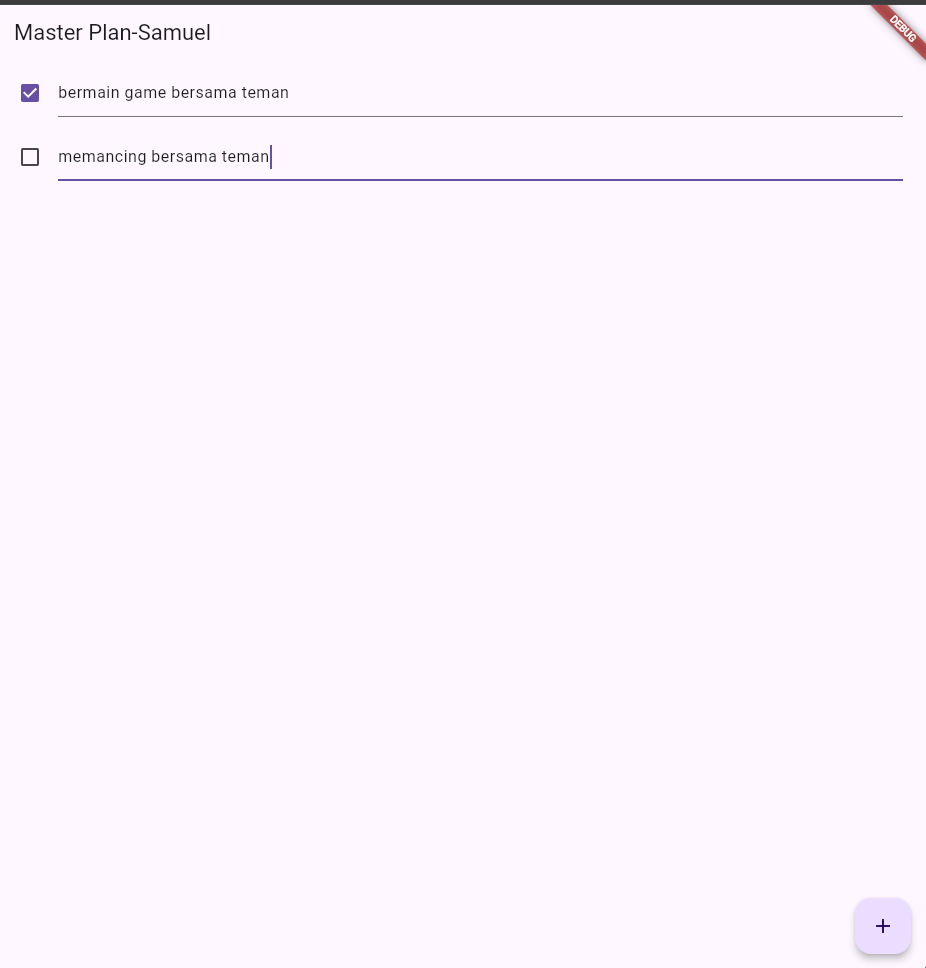

NAMA    : Samuel Rivaldo Saragih
KELAS   : 2B TRPL
NIM     : 362358302156

1. Hasil Source Code

2. Jelaskan maksud dari langkah 4 pada praktikum tersebut! Mengapa dilakukan demikian?
menginisialisasi variabel atau mempersiapkan data yang akan digunakan di langkah berikutnya.

3. Mengapa perlu variabel plan di langkah 6 pada praktikum tersebut? Mengapa dibuat konstanta ? Dibuat sebagai konstanta untuk memastikan nilainya tetap tidak berubah sepanjang eksekusi, menjaga konsistensi dan mencegah kesalahan.

4. Apa kegunaan method pada Langkah 11 dan 13 dalam lifecyle state ? Bisa digunakan untuk membersihkan atau menangani perubahan state saat widget dihancurkan atau diperbarui